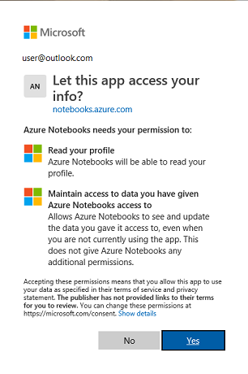
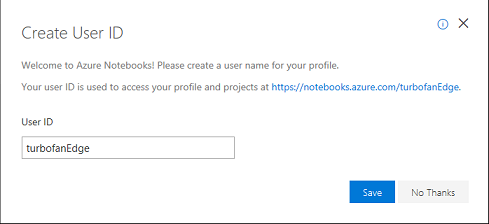
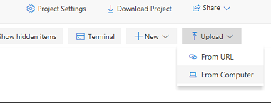
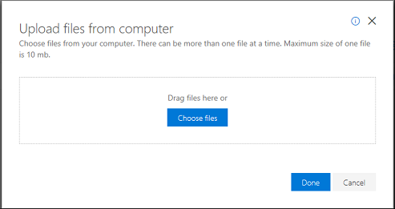
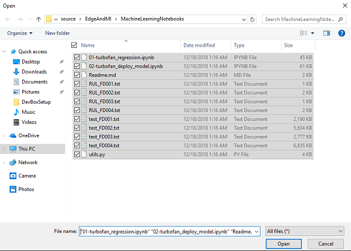
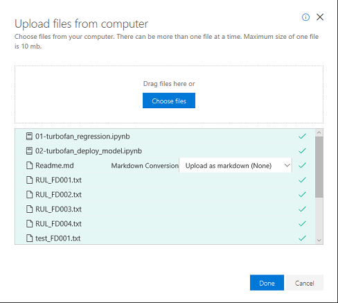
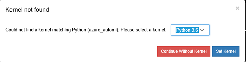
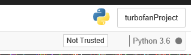
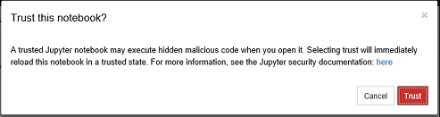

# Train RUL model for turbofan data using AutoML and Azure Notebooks
## Prerequisites
1. Before using these notebooks to train and deploy a classifier you need to have:
   * Set up your development machine with all pre-requisites
   * Used the DeviceHarness to generate and send device data to Azure Storage via IoT Hub  

    Details for how to complete those steps can be found in the [IoT  Edge for Machine Learning](aka.ms/IoTEdgeMLPaper) white paper.

1. From the Azure subscription where you uploaded the data you will need:
    1. Subscription ID 
    1. IoT Hub Name
    1. Storage account (where the device data was routed)
        * Storage account name 
        * Blob container name 
        * Storage account access key 
## Introduction
This project contains to Jupyter notebooks. The first notebook, [01-turbofan_regression](./01-turbofan_regression.ipynb) walks through the process of using the data from the turbofan devices to train a Remaining Useful Life (RUL) prediction model.  The second notebook, [02-turbofan_deploy_model](./02-turbofan_deploy_model.ipynb), depends on completion of the first and demonstrates how to create a deployable Edge module from the model created in the first notebook.

Throughout, we rely heavily on Jupyter notebooks for our explanation and execution of Machine Learning.  If you have not used Jupyter and/or Azure Notebooks here are a couple of introductions to get you started
1. **Quickstart:**  [Create and share a notebook](https://docs.microsoft.com/en-us/azure/notebooks/quickstart-create-share-jupyter-notebook)
1. **Tutorial:** [Create and run a Jupyter notebook with Python](https://docs.microsoft.com/en-us/azure/notebooks/tutorial-create-run-jupyter-notebook)

## Set up and configuration 
1. Open [Azure Notebooks](https://notebooks.azure.com)
1. Click on sign-in
1. Enter crendentials using Azure Active Directory or Microsoft Account
1. Grant Azure Notebooks access to you profile:

    
1. Create an Azure Notebooks user id

    
1. In the title bar click "My Projects"

    
1. Click '+ New Project'

    img src="./images/newProject.png"/>
1. Fill in new project dialog:

    
1. Click on 'Upload' and choose 'From Computer'

    
1. Click on 'Choose files'

    
1. Navigate to C:\source\EdgeAndMl\MachineLearningNotebooks and select all files and click 'Open'

    
1. Click 'Upload' to upload the files then click 'Done'

    
1. From the turbofan project page click on `01-turbofan_regression.ipynb`
1. Choose the Python 3.6 Kernel from the dialog and click 'Set Kernel'

    
1. Click on the 'Not Trusted' widget in the top right of the notebook

    
1. In the dialog click on 'Trust'

    
1. Follow the instructions in the notebooks 
   * Start with [01-turbofan_regression](./01-turbofan_regression.ipynb)
   * Continue with [02-turbofan_deploy_model](./02-turbofan_deploy_model.ipynb)
